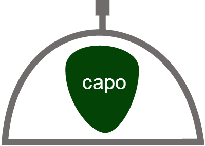
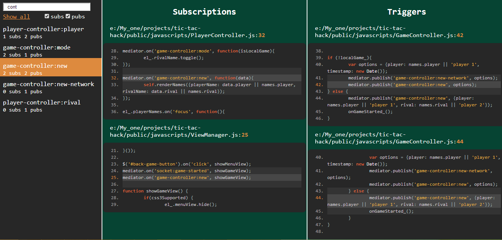
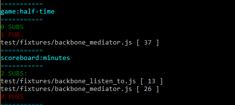

capo [](https://travis-ci.org/msemenistyi/capo)
====

Capo will help you to cope with your Mediator. All strings are touched.



## Install
> npm install -g capo

## Overview
Capo is a module that serves for managing event-driven js architectures and 
encourages mediator pattern usage solving its biggest weakness - uncertainty
of event triggers and listeners.   

Capo opens files in folder you've provided looking for events being
published or subscribed to and tracks them. The next action is report building.
By default html reporter is used. In this case 'capo' folder is created in the 
folder of capo command execution, report.html is the file you are looking for.

##Html Report

To the left event panel is situated where all the events found by provided 
path are placed. You can use filter to find event quicker and then click `Show all`
button to restore all the events in panel. Subs and pubs checkboxes are used to 
show just one of them full-sized.  
Click on event name leads to corresponding subs and pubs columns update.  
**Strange events** section stands for events which have either 0 pubs or 0 subs 
which may cause problems you are searching for. Filtering does not affect this section.    
**IE8+**

##Cli Report
  
Preferably this report is used with event option defined.  
```shell
	capo /home/web/javascripts -e app:match
```


##Usage patterns

Module may be used on mediator.js, Backbone.js, node.js EventEmitter or any other
object which provides publish-subscribe interface. 

Capo can be very useful for creating documentation on appilcation events. 
Furthermore capo provides appropriate media print style so that report can be printed.
If you select event you need to document and then press print button, needed 
events will be aligned fine and placed one under another.

Another great usage example is trying to understand someone's event-driven code. These
are hard times for every dev, because initially you don't have any understanding
on how this works, but one of the first things you may do is run capo.

Html report contains `Strange events` section which contains events with 0 subs or
0 pubs. This may help to fix or clean up your code.

Capo also has option of strict mode, which will throw error on sub for event 
with 0 pubs. It may be used as a build step to avoid such type of errors.

Besides, there is a [generate spy](#spy-generator) option that will generate you listeners for 
all the triggers found in application. 

**Warning:** Be aware that capo doesn't work right with event subscriptions
defined within one method and delimited with space
```js
this.listenTo(Backbone, 'asd:asd gdf:gdf asda:asd', function...)
```
This code snippet will be interpreted as one event named 
`asd:asd gdf:gdf asda:asd`. This feature may be implemeted and stay hidden behind 
the flag of space splitting, but I doubt that there will be request for 
supporting this.

##Usage

Search in javascripts folder. Mediator object name is Backbone.
```shell
capo ./javascripts -o Backbone
```

Print results to command-line.
```shell
capo ./javascripts -o Backbone -r cli
```

The same query but for exactly 'app:match-context' event.
```shell
capo ./javascripts -o Backbone -e app:match-context
```

Be quiet.
```shell
capo ./javascripts -o Backbone -s
```

Log everything.
```shell
capo ./javascripts -o Backbone -v
```
Generate spy
```shell
capo ./javascripts -o Backbone -g
```

Generate spy for event/namespace
```shell
capo ./javascripts -o Backbone -e app -g
```


###Options
- **event**   -e --event - event name to perform search on. Can be just leading chars
of event name (e.g. `-e ap` will find all the events starting with these chars:
`ap, app, ap:message, app:context, application`).  
- **object**  -o --object - mediator object name (e.g. mediator, Backbone). Case sensitive.  
- **silent**  -s --silent - won't put anything into stdout. At all. **Default** `false`.  
- **report**  -r --report - type of report. Options are: `html`, `cli`. **Default**
is `html`. String value should be specified right after flag.  
- **verbose** -v --verbose - log all the files processed and other info. **Default** `false`.  
- **strict**  --strict - throw error on sub for event with 0 pubs. **Default** `false`.
- **generate** -g --generate - generate file with listeners for all the triggers. **Default** `false`.  
- **help**    -h --help - show help

##Spy generator
Capo may generate spy script if **generate** option is enabled. It will form
spy.js file in capo folder:

```js
	function spyHandler(eventName, data){
		console.log(eventName + ' triggered');
	}

	mediator.on('player:initialize', spyHandler.bind(null, 'player:initialize'));
	mediator.on('game-started', spyHandler.bind(null, 'game-started'));
```
Script contains subscriptions to all the triggers found by capo in project
(may be filtered by event name if defined).

spyHandler function serves as a handler for all the listeners. It accepts two parameters:
- **eventName** - the name of event triggered.
- **data** - data sent through mediator.  

By default handler contains event name logging when triggered but it may be changed
to anything you'd like to.

Spy script does not contain any module loading system wrappers so if you're using
it in your project, you will have wrap spy.js with CommonJS/AMD wrapper if you 
want to include it or just copy/paste it into one of your files.


###capo.opts
While developing you might want to regenerate report quite often so in order not
to specify all the options through the Command-Line Inteface you may create file
named **capo.opts** which will contain the same options you could specify in cli.

[Example](https://github.com/msemenistyi/capo/blob/master/test/capo.opts) of capo.opts:
```shell
	d:/javascripts
	-o Backbone
	-r cli
```
If these are all options you need you may just execute one command in the folder 
containing capo.opts file:
```shell
	capo
```
Still arguments in cli will have higher priority than ones in capo.opts file.  


###Programmatic API

```js
	var capo = require('capo');
	capo(__dirname, 'Backbone').event('match:ticker-state').find(function(err, data){
		//do something with everything
	}

```
- **capo**(*String* | *Array* path, *String* mediatorName, *Object* options) - 
capo factory. Accepts path which may be a .js file path, folder path or array of
 .js paths. Second option is mediatorObject name, which means the one that 
implements inerface of on|once|subscribe and emit|publish|trigger and is used 
in applcation. Object parameter contains options hash described earlier.  
- **event**(*String* eventName) - event method serves for providing event name
which will be passed to capo to perform search on it. Is optional in chain. 
**By default** capo searches for all the events.  
- **find**(*Function* callback) - method which starts search. Accepts callback with
two parameters: **err** - capo, pick-lines-from-files or fs errors and **data**.  

**Data** hash consists of:  
- **Files** - array of js files which search was performed on.  
- **Subscriptions**  
- **Triggers**   
Both last properties are hashes with event-named keys. One line containing event
is one hash in value array.

```js
	{ 
		'match:ticker-state':[{ 
				file: 'e:\\My_one\\projects\\capo\\test\\fixtures\\backbone_listen_to.js',
				line: 15 
			}, 
			...
		],
		...
	}
```
###Continuous integration
For continuous integration grunt plugin may be used.
[https://github.com/msemenistyi/grunt-capo ](https://github.com/msemenistyi/grunt-capo)

##Contributing
Feel free to open issues and send PRs, though make sure that you create tests
for new functionality and amend ones for fixes and changes. 

## Running tests
Run `npm test` in order to see test results.

## License

The MIT License (MIT)

Copyright (c) 2014 Semenistyi Mykyta nikeiwe@gmail.com

Permission is hereby granted, free of charge, to any person obtaining a copy
of this software and associated documentation files (the "Software"), to deal
in the Software without restriction, including without limitation the rights
to use, copy, modify, merge, publish, distribute, sublicense, and/or sell
copies of the Software, and to permit persons to whom the Software is
furnished to do so, subject to the following conditions:

The above copyright notice and this permission notice shall be included in
all copies or substantial portions of the Software.

THE SOFTWARE IS PROVIDED "AS IS", WITHOUT WARRANTY OF ANY KIND, EXPRESS OR
IMPLIED, INCLUDING BUT NOT LIMITED TO THE WARRANTIES OF MERCHANTABILITY,
FITNESS FOR A PARTICULAR PURPOSE AND NONINFRINGEMENT. IN NO EVENT SHALL THE
AUTHORS OR COPYRIGHT HOLDERS BE LIABLE FOR ANY CLAIM, DAMAGES OR OTHER
LIABILITY, WHETHER IN AN ACTION OF CONTRACT, TORT OR OTHERWISE, ARISING FROM,
OUT OF OR IN CONNECTION WITH THE SOFTWARE OR THE USE OR OTHER DEALINGS IN
THE SOFTWARE.
